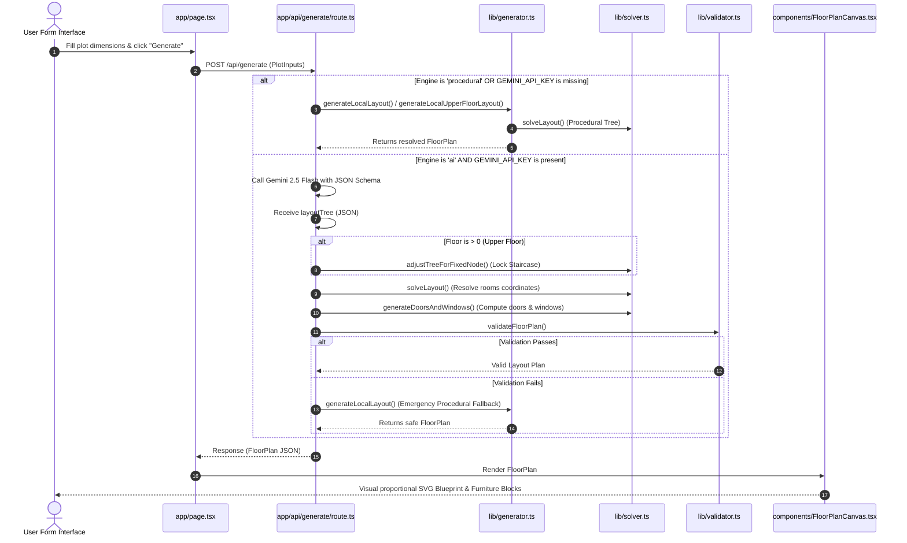

# 🏠 VastuPlan AI — Complete Codebase Architecture & File Guide

This document provides a highly detailed, file-by-file breakdown of the **VastuPlan AI** application. It serves as a guide for developers, architects, and collaborators to understand what problem we are solving, the exact layout algorithms we use, which files contain which sections of the code, and how they interact.

---

## 1. Project Goal & The Problem Solved

**VastuPlan AI** is a Next.js full-stack web application designed for Indian plot owners to instantly generate and visualize **proportional, Vastu-compliant 2D floor plans** matching standard plot dimensions (e.g., 30x40, 20x40 ft). 

### Key Architectural Challenges Solved:
1. **Overlap Prevention**: Standard LLMs fail at predicting precise `(x, y, w, h)` coordinates, which leads to rooms overlapping or extending outside the plot boundary. We solve this by having the AI output a **recursive binary slicing tree** instead of raw coordinates.
2. **Staircase Alignment (Multi-Floor)**: In multi-story (G+1/G+2) structures, the staircase footprint *must* lock vertically on upper levels, while surrounding rooms adapt. We solve this by implementing a **recursive split-ratio adjuster** that forces the slicing tree to place the staircase at the exact coordinates of the ground floor.
3. **Geometry-Based Door & Window Placement**: Rather than leaving door/window placement to LLM guesswork, our geometry engine detects adjacent room bounds to place internal door swings, road-facing main entry doors, and external window segments.
4. **Reliability & Fallbacks**: If the Gemini API key is missing or validation checks fail, the application instantly routes to a **deterministic procedural generator**, ensuring the user is never shown a blank page.

---

## 2. Request & Generation Lifecycle

Here is a visual sequence diagram detailing the step-by-step workflow when a user requests a floor plan layout:



---

## 3. Directory Structure

Below is the project's file structure, indicating where all visual, backend, and logic code resides:

```
c:/Users/ANIKET/Desktop/Aihouseplan/
├── ABOUT.md                             ← This detailed architectural guide
├── AGENTS.md                            ← Next.js agent execution rules
├── CLAUDE.md                            ← Basic build commands
├── README.md                            ← Standard user setup documentation
├── .env.local                           ← Environment secrets (GEMINI_API_KEY)
├── next.config.ts                       ← Next.js project configuration
├── package.json                         ← Dependencies and scripts
├── tsconfig.json                        ← TypeScript compiler rules
├── app/
│   ├── favicon.ico                      ← App browser icon
│   ├── globals.css                      ← Global CSS & Tailwind CSS v4 variables
│   ├── layout.tsx                       ← Root React Layout (Fonts & Metadata)
│   ├── page.tsx                         ← Main Dashboard page (State & Orchestration)
│   └── api/
│       └── generate/
│           └── route.ts                 ← Next.js Server Route (Gemini Integration)
├── components/
│   ├── InputForm.tsx                    ← Form panel (Presets, Customizations, Sliders)
│   └── FloorPlanCanvas.tsx              ← SVG rendering engine (Walls, Furniture, Export)
└── lib/
    ├── types.ts                         ← TypeScript types & interfaces
    ├── solver.ts                        ← Hybrid geometric solvers (Slicing, Doors, Staircase)
    ├── generator.ts                     ← Local procedural rule-based generator
    └── validator.ts                     ← Floor plan dimensions validation suite
```

---

## 4. File-by-File Code Documentation

Here is the exact description of what is contained inside each code file and what it does.

---

### 📂 Shared Models & Definitions

#### 📄 [types.ts](file:///c:/Users/ANIKET/Desktop/Aihouseplan/lib/types.ts)
This file defines all core TypeScript interfaces that secure type-safety across the API client-server divide.
* **`PlotInputs`**: Represents inputs collected by the user form:
  * `lengthFt`, `breadthFt`: Plot boundary size in feet.
  * `orientation`, `roadFacing`: Cardinal directions.
  * `bedrooms`, `bathrooms`, `parking`, `garden`, `poojaRoom`, `vastu`: Building preferences.
  * `style`, `engine` (`"ai" | "procedural"`), `floors` (`1 | 2 | 3`), `familyType`, `kitchenType`, `servantQuarters`.
* **`Room`**: Holds physical room coordinate dimensions:
  * `id`: Unique identifier (e.g., `"bedroom-master"`, `"kitchen"`, `"living"`).
  * `label`: User-facing name (e.g., `"Master Bedroom"`).
  * `x`, `y`: Top-left origin coordinates in feet.
  * `width`, `height`: Rectangle size dimensions in feet.
* **`Door`**: Describes a door's location:
  * `room`: Room ID this door belongs to.
  * `wall`: `"top" | "bottom" | "left" | "right"` placement.
  * `position`: Distance in feet from the top-left corner of the room wall.
  * `width`: Door opening span in feet (default `3`).
* **`Window`**: Describes a window location (same structure as `Door`).
* **`FloorPlan`**: The final resolved object returned to the frontend containing:
  * `floor`: Floor index (`0` for Ground, `1` for First, `2` for Second).
  * `plotLength`, `plotBreadth`: Overall dimensions.
  * `rooms`: Array of `Room` elements.
  * `doors`: Array of `Door` elements.
  * `windows`: Array of `Window` elements.
  * `staircase`: Coordinates `(x, y, width, height)` of the staircase (locked across floors).
  * `explanation`: Text detailing the Vastu alignment or layout decisions.

---

### 📂 Geometric Solvers & Post-Processors

#### 📄 [solver.ts](file:///c:/Users/ANIKET/Desktop/Aihouseplan/lib/solver.ts)
The heart of our geometric solver engine. It performs the mathematics of translating slicing trees into physical coordinates, aligning multi-floor structures, and generating doors/windows.
* **`LayoutNode`**: A custom recursive type representing either a `"split"` (cut line) or a `"room"` leaf. A split has a `direction` (`"horizontal"` or `"vertical"`), a split `ratio` (between `0.05` and `0.95`), and exactly two `children: [LayoutNode, LayoutNode]`.
* **`solveLayout(node, x, y, w, h, wallThickness)`**: 
  * *What it does*: Recursively traverses the `LayoutNode` tree and partitions the parent coordinate box.
  * *Internal Logic*: If the node is a `"split"`, it checks the `direction`. If `horizontal`, it computes a split width `w1 = w * ratio`, subtracts half of the `wallThickness`, places `child1` on the left and `child2` starting at `x + w1 + wallThickness` (with width `w - w1 - wallThickness`). If `vertical`, it splits along the Y-axis. Leaf rooms are rounded to `0.1` ft precision.
* **`adjustTreeForFixedNode(node, x, y, w, h, targetId, tx, ty, tw, th, wallThickness)`**:
  * *What it does*: Adjusts split ratios recursively on upper floors to force a specific room ID (e.g., `"staircase"`) to align exactly with ground floor coordinates `(tx, ty, tw, th)`.
  * *Internal Logic*: It looks up which branch contains the target node. When it finds a split separating the target node from its neighbors, it adjusts the split ratio so that the split line matches either the left/top or right/bottom boundary of the target node.
* **`generateDoorsAndWindows(rooms, plotLength, plotBreadth, roadFacing, vastu)`**:
  * *What it does*: Calculates intersections between room boundaries to position doors and windows.
  * *Internal Logic*: 
    1. **Adjacency Check**: Intersects room segments (sharing a boundary within `0.25` ft) to identify shared internal walls and external walls.
    2. **Windows**: Places windows centering them on external walls. Small rooms like bathrooms get `2.0` ft ventilation windows; bedrooms and living rooms get large `4.0` ft windows.
    3. **Main Entrance**: Centers a `3.5` ft main entrance door on the road-facing wall of the living room.
    4. **Internal Doors**: Places doors only on internal shared walls, prioritizing corridors, lobbies, and living rooms. Bathroom doors are placed adjacent to bedrooms, avoiding kitchen openings.

---

### 📂 Procedural & Rule Engines

#### 📄 [generator.ts](file:///c:/Users/ANIKET/Desktop/Aihouseplan/lib/generator.ts)
This acts as our local CAD generator. If the AI generator fails, this local code immediately renders a high-quality, proportional, Vastu-compliant plan.
* **`generateLocalLayout(inputs)`**:
  * *What it does*: Generates the Ground Floor plan procedurally.
  * *Internal Logic*:
    1. **Usable Space**: Subtracts a setback margin around the plot (`0.5` ft for narrow plots <= 22 ft, `1.5` ft for standard plots) to represent boundaries.
    2. **Adaptive Room Dropping**: Evaluates the usable area. If the plot is too small, it drops non-essential rooms recursively from a priority stack (`Pooja Room` -> `Extra Bathroom` -> `Bedroom 3` -> `Car Parking` -> `Bedroom 2` -> `Garden`) to ensure remaining rooms satisfy minimum sizing guidelines.
    3. **Plot Slicing Selection**:
       - *Narrow Plots (<= 22 ft width)*: Designs a linear slicing layout splitting the plot into three vertical zones: Back (Master Bedroom + Kitchen), Middle (Living Room + Bathrooms column), and Front (Staircase + Parking or Bedroom 2).
       - *Standard Plots*: Generates a 3-row zones layout (Back: Master Bed + Bath + Kitchen; Middle: Bedroom 2 + Bathroom 2 + Pooja; Front: Living Room + Staircase + Parking/Garden).
    4. Calls `solveLayout` and `generateDoorsAndWindows` to complete coordinates resolution.
* **`generateLocalUpperFloorLayout(inputs, floorNumber, staircase)`**:
  * *What it does*: Generates upper floors (Floor 1 & 2) procedurally.
  * *Internal Logic*: Takes Ground Floor staircase coordinates and forces them onto the upper floor map. Map structures are adapted: Kitchen becomes `Guest Bedroom`, Parking becomes `Balcony`, Living becomes `Family Lounge`, Garden becomes `Open Terrace`, and Pooja becomes `Study Room`.

---

### 📂 Validation Pipeline

#### 📄 [validator.ts](file:///c:/Users/ANIKET/Desktop/Aihouseplan/lib/validator.ts)
Before sending any plan to the frontend, this utility validates the structure to verify compliance.
* **`validateFloorPlan(plan)`**:
  * *Checks performed*:
    1. **Boundary check**: Verifies that no room coordinates exceed `plotLength` or `plotBreadth` (with a `0.1` ft allowance).
    2. **Overlap check**: Runs an Axis-Aligned Bounding Box (AABB) intersection check between all rooms (excluding garden/parking) to ensure they do not intersect.
    3. **Minimum Room Sizes (Section 10)**: Checks minimum dimensions (e.g., Master Bed >= 11x12 ft, Kitchen >= 7x9 ft, Staircase >= 3.5x8 ft) with looser snas (tolerance of `0.55` ft) on narrow plots <= 22 ft.
    4. **Aspect Ratio Check**: Ensures no room is longer than a 3:1 ratio (preventing corridor-like habitable rooms).
    5. **Door Existence Check**: Confirms that every habitable room has at least one door connecting to the rest of the floor plan.

---

### 📂 Backend Controller

#### 📄 [route.ts](file:///c:/Users/ANIKET/Desktop/Aihouseplan/app/api/generate/route.ts)
The API route controller that handles incoming requests.
* **`POST(req)`**:
  * *Action Flow*:
    1. Extracts client JSON inputs.
    2. If `engine === "procedural"` or `GEMINI_API_KEY` is not set, it calls the local generator (`generateLocalLayout` or `generateLocalUpperFloorLayout`) and returns immediately.
    3. If `engine === "ai"`, it initializes the **Google Gemini API** (`gemini-2.5-flash`).
    4. Passes the parameters to Gemini along with a highly detailed, strict prompt detailing Vastu guidelines, room sizing, and slicing rules, forcing structured JSON return via a schema structure mapping the `layoutTree`.
    5. On return, it parses the layout tree (`parseAITree`) and solves the coordinates (`solveLayout`).
    6. For upper floors (Floor > 0), it runs `adjustTreeForFixedNode` with Ground Floor staircase coordinates to lock the staircase position.
    7. Post-processes openings with `generateDoorsAndWindows`.
    8. Executes `validateFloorPlan`. If successful, returns the layout. If validation fails or the API errors, it catches the error and falls back to the local generator, returning a valid plan.

---

### 📂 Frontend Interface

#### 📄 [page.tsx](file:///c:/Users/ANIKET/Desktop/Aihouseplan/app/page.tsx)
The entry point dashboard that houses all state and user actions.
* **State Variables**:
  * `floors`: Array storing layouts for Ground, First, and Second floors.
  * `activeFloor`: Currently visible floor tab index (`0`, `1`, or `2`).
  * `inputs`: Current configuration values.
  * `isLoading`: Generation loading state indicator.
  * `generationInfo`: Displays how the active plan was generated (e.g. "designed by Gemini AI", "Rendered using local rules").
  * `lockedEngine`: Locks the engine type (`"ai"` or `"procedural"`) once Ground Floor is generated, ensuring upper floor layouts align.
* **`handleGenerate(newInputs)`**: Initiates generation. Triggers a POST request to `/api/generate` for Ground Floor (Floor 0), saves layout, and sets generation metadata.
* **`handleFloorTabChange(floorNum)`**: Manages upper-floor generation. If the floor plan has not been generated, it loads the Ground Floor's staircase coordinates and queries the backend for the upper level, caching the result in the `floors` state array.
* **UI Grid Layout**:
  * Left: Renders `InputForm` inside a collapsible container.
  * Right: Displays generation badges, floor switcher tabs (if multi-floor), `FloorPlanCanvas`, and the design explanation drawer.

#### 📄 [InputForm.tsx](file:///c:/Users/ANIKET/Desktop/Aihouseplan/components/InputForm.tsx)
The UI control board built with React and Tailwind CSS v4.
* **Presets**: Offers single-click presets representing common Indian plots (20x30, 20x40 narrow, 30x40 standard, 30x50, 40x60).
* **Sliders**: High-precision range sliders for Plot Width and Depth (bounded 15 - 80 ft).
* **Vastu & Customization**: Dropdowns for orientation and road access, selection tabs for floors (1-3), bedroom/bathroom counts, and checkbox toggles (Apply Vastu, Parking, Garden, Pooja Room, Servant Quarters).
* **Engine Selectors**: Tab switcher between "Instant Rules" (procedural) and "Gemini AI" (if a key is available).

#### 📄 [FloorPlanCanvas.tsx](file:///c:/Users/ANIKET/Desktop/Aihouseplan/components/FloorPlanCanvas.tsx)
The visual rendering engine. Takes the generated JSON and outputs a 2D CAD floor plan.
* **`ROOM_STYLES`**: Defines curated pastel color coding, custom border colors, text labels, and emojis per room type (e.g., `#F3F8FC` soft blue for master bedroom, `#FFFBEA` gold for pooja room, `#FCFBF7` slate for living).
* **`renderFurniture(room)`**: Converts room offsets and draws vectors representing double beds (pillows and blankets), L-shaped kitchen counters (stove burners and sinks), dining tables, bathroom WC toilets, parking cars, and pooja altars.
* **`renderStaircase(room)`**: Renders staircase treads, center separation guidelines, direction arrows, and "UP" markers.
* **`renderDoor(door, room)` & `renderWindow(win, room)`**: Renders door swings (swing panel and radial arc swing direction) and window apertures (sill borders and cyan-colored glass panes).
* **`renderSVGContent()`**: Bundles structural elements together:
  * Grid paper background and outer plot boundary line.
  * Solid structural walls (`#334155` slate representing brickwork).
  * Room floors, labels, and dimension tags (e.g. `12.5' x 11.0'`).
  * Outer road access indicator street strip.
  * Outer driveway gates and main entrance indicator stars.
  * Overlaid Red Vastu 3x3 cardinal grid (NE, NW, SE, SW, Brahmasthan).
  * True direction Compass pointer.
* **Toolbar Actions**:
  * **Vastu Grid Toggle**: Overlays the 3x3 Vastu mandala.
  * **Export SVG**: Serializes the SVG XML element into a download link.
  * **Export PNG**: Draws the SVG onto a high-DPI canvas client-side and exports it.
  * **Fullscreen Modal**: Opens an interactive modal overlay supporting zooming (using +/- keys or fit commands) and JSON payload copying.

#### 📄 [layout.tsx](file:///c:/Users/ANIKET/Desktop/Aihouseplan/app/layout.tsx)
Sets up global configuration, viewport settings, metadata (title and description for SEO optimization), and imports the **Plus Jakarta Sans** (sans font) and **Outfit** (architectural labels font) from Google Fonts, passing them to the Next.js font loader.

#### 📄 [globals.css](file:///c:/Users/ANIKET/Desktop/Aihouseplan/app/globals.css)
* **Tailwind v4 Integration**: Uses `@import "tailwindcss";` to initialize Tailwind CSS.
* **Global Theme Rules**: Configures dark/light background variables and sets default styling rules for the document body.

---

## 5. Summary of Key Algorithms

### Binary Slicing Tree (BSP) Division
Rooms are not placed arbitrarily. Instead, a parent bounding box representing the plot is recursively divided. Every division node represents a cut line:
```
  [Usable Plot Box: 27 x 37]
        /            \
 [Split Horiz: 0.65]  [Remaining space]
      /         \
 [Master Bed]  [Kitchen]
```
Because splits partition existing space, **rooms are guaranteed never to overlap** and always sum up to exactly the plot boundaries.

### Recursive Staircase Ratio Adjuster
On upper floors, the staircase coordinate position must lock exactly with the ground floor. 
1. The AI generates a new slicing tree arrangement.
2. The engine detects the path from the root node to the `"staircase"` leaf.
3. For every ancestral split, it replaces the split ratio. If the ancestor is a horizontal split, it calculates `ratio = target_x / parent_width` to squeeze the split line to match the target staircase position.
4. The remaining rooms on that floor scale around the locked staircase coordinates.

### Graceful Procedural Fallback
If the Gemini API key is missing or the response fails validation checks (e.g. a room is too narrow or missing a door), the system falls back to `generator.ts` to compute split ratios procedurally, guaranteeing that a proportional floor plan is always rendered immediately.

---

## 6. Code Evaluation: The Good, The Bad, & Known Issues

To help maintain, debug, and review the codebase, this section documents the architectural strengths, design compromises (technical debt), and known bugs or edge cases in the current implementation.

### 🟢 The Good (Architectural Strengths)
* **Mathematical Overlap Immunity**: By using a recursive binary space partition (`solveLayout`) instead of predicting arbitrary `(x, y)` coordinate boxes, the rooms **can mathematically never overlap**. This eliminates the primary structural bug of traditional LLM coordinate generators.
* **Smart Separation of Concerns**: The LLM is restricted to creating layout hierarchies and topologies (which rooms are adjacent to what), while the local TypeScript engine handles coordinate details, wall thicknesses, and geometry boundaries. This reduces prompt length and increases layout correctness.
* **Extremely Resilient Fail-Safes**: If the Gemini API experiences network timeouts, rate-limiting, missing API keys, or outputs invalid room shapes that fail safety checks, the validator intercepts it and serves a clean, local procedural plan. The user is guaranteed to see a beautiful layout under any condition.
* **SVG CAD Fidelity**: Instead of plain boxes, [FloorPlanCanvas.tsx](file:///c:/Users/ANIKET/Desktop/Aihouseplan/components/FloorPlanCanvas.tsx) renders complete visual details (double beds, kitchen hobs, dining table sets, bathrooms WC bowls, staircase arrow lines, and road access indicators), making the blueprint feel like an active CAD mockup.

### 🟡 The Bad (Technical Debt & Limitations)
* **Snapping Vulnerability in Staircase Locking**: The `adjustTreeForFixedNode` adjuster walks the layout tree and forces split ratios to lock the staircase coordinate. If the AI-generated layout places the staircase inside a deeply nested branch or groups it with incompatible rooms, adjusting the ratios can squeeze neighboring rooms down to narrow strips, leading to validation failures and triggering the procedural fallback.
* **Naïve Setback Margins**: The current system applies a flat setback (`0.5` ft for narrow plots, `1.5` ft for wide plots) uniformly on all sides. In realistic Indian municipal bylaws, setback regulations require asymmetrical space (e.g. larger front setbacks for roads, and smaller margins on the sides).
* **Stateless API Requests**: The backend is stateless. When generating upper floors, the frontend must pass the ground floor's exact staircase boundaries alongside client inputs. If the user clears the page state, the correlation between ground and first floor elements is lost.
* **Hardcoded Furniture Coordinates**: Furniture vectors are positioned based on fixed distance offsets from the internal room corners. If a room shape is extremely wide or thin, the furniture may align awkwardly or clip boundaries.

### 🔴 Known Issues & Edge Cases
* **Door-Furniture Intersections**: Doors are placed mathematically at the center of shared room walls. Because furniture is also drawn relative to the room boundaries, it is possible for a door swing panel to overlap with a bed headboard or dining chairs in very small rooms.
* **Narrow Plot Vastu Compromises**: On narrow plots (e.g., width <= 22 ft), forcing Vastu rules (Master Bedroom in South-West, Kitchen in South-East) makes the layout tree very rigid. This can result in narrow corridors or bathrooms squeezed between rooms.
* **Snapped Grid Snaps**: Snapping solved coordinates to the nearest `0.1` ft can sometimes leave tiny gaps of `0.05` ft between internal wall lines on highly divided layout trees.
* **Upper Floor Logic Variations**: The structural alignment of columns and load-bearing walls is currently ignored. While the staircase matches vertically, a bedroom on the first floor might sit directly over a kitchen void from the ground floor, which is structurally unbuildable without pillars.

---

## 7. Areas for Feedback & Future Improvement

Here are some points you can bring up when discussing this project with other developers:

1. **Setbacks & FAR Calculations**: Currently, setback margins are simplified (1.5 ft or 0.5 ft). How could we dynamically query municipal laws (like FAR - Floor Area Ratio) to make setbacks legally accurate?
2. **3D Rendering**: We currently render in 2D SVG. Would it be better to compile the solved JSON coordinate array into a 3D preview using Three.js / WebGL?
3. **Plumbing & Column stacks**: Should we add recommendation markers for plumbing shafts (placing bathrooms vertically above each other) and columns to make the plan more buildable?
4. **Interactive Resizing**: Should we add drag-and-drop handles on the SVG canvas so users can customize the split ratios manually after generation?

---

## 8. Developer Quickstart & CLI Verification

### Running the App Locally
To run the Next.js development server on your system:
```bash
# Install dependencies
npm install

# Run the local development server
npm run dev
```
Open [http://localhost:3000](http://localhost:3000) inside your browser to view the interactive application canvas.

### Verifying API Key Connectivity
A CLI utility script [test_gemini.ts](file:///c:/Users/ANIKET/Desktop/Aihouseplan/test_gemini.ts) is provided in the root directory to test your API key configuration and connectivity to the Google Gemini service without opening the browser:
```bash
# Run the verification script
npx tsx test_gemini.ts
```
* **What it does**: Reads the `GEMINI_API_KEY` directly from your local `.env.local` file, checks if the key matches, instantiates the Generative AI library, and fires a one-word query to `gemini-2.5-flash`.
* **Output**: Prints the response text or catches any rate-limit, auth, or network errors directly in your terminal console logs.
